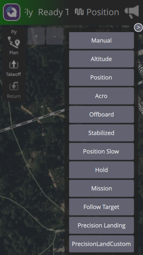

### Video Walkthrough
[Watch the video on YouTube](https://youtu.be/3BJB3OAo3tw?si=rJiTScTOzJzZjN2t)


### Prerequisites
* Ubuntu 22.04
* ROS2 Humble
* Gazebo Harmonic
* Micro XRCE-DDS Agent
* QGroundControl Daily Build
* OpenCV 4.10.0

### Setup the Workspace
Make sure you source ROS2 Humble in the terminal you are using. You can add this line to your ~/.bashrc if you want it sourced every time you open a new terminal.
```
source /opt/ros/humble/setup.bash
```

Navigate to the directory you would like to place the worskpace and then run the following
```
git clone --recurse-submodules https://github.com/ARK-Electronics/tracktor-beam.git
```

Then navigate into the workspace:
```
cd tracktor-beam
```

Install OpenCV from source
```
./install_opencv.sh 
```

Set the GZ_VERSION environment variable
```
export GZ_VERSION=harmonic
```

Build the workspace
```
colcon build
```

After this runs, we do not need to build the whole workspace again, you can just build the individual packages you have modified
```
colcon build --packages-select precision_land
```

Source the workspace
```
source install/setup.bash 
```

### Run the example

#### Run the simulation environment
This workspace is tested against a specific version of PX4. Please use PX4 commit 86f2fdfd7de7f5e5d29ab61f60d81e892a557376.

Launch PX4 Simulation
```
make px4_sitl gz_x500_gimbal_aruco
```

Launch MicroXRCEAgent
```
MicroXRCEAgent udp4 -p 8888
```

Launch all of the nodes
```
ros2 launch precision_land precision_landing_system.launch.py
```

View the video (/image_proc is the annoted image)
```
ros2 run rqt_image_view rqt_image_view
```

Once the nodes are running the Precision Land mode is going to show up in QGC. Make sure to pitch the gimbal down in QGC.



## ARK Electronics
Checkout our [online store](https://arkelectron.com/)
Follow us on [LinkedIn](https://www.linkedin.com/company/ark-electronics-llc/)
Follow us on [X](https://x.com/ark_electr0nics)


## Questions
Message Patrik Dominik Pordi on the ARK Electronics / Dronecode Foundation Discord for questions or email me at patrik@arkelectron.com

[ARK Electronics Discord](https://discord.gg/un4HYu8k)


## Additional resources
[LinuxCheatSheet](https://www.geeksforgeeks.org/linux-commands-cheat-sheet/)

[ROS2CheatSheet](https://www.theconstruct.ai/wp-content/uploads/2021/10/ROS2-Command-Cheat-Sheets-updated.pdf)

[CMakeBasics](https://nu-msr.github.io/navigation_site/lectures/cmake_basics.html)


## Running on a drone

### Hardware
#### Prerequisites
* Ubuntu 22.04
* ROS2 Humble
* Drone with downward facing camera
* Micro XRCE-DDS Agent
* QGroundControl
* OpenCV 4.10.0
* Camera node:

You can either run the the nodes or turn them into a service, that starts at boot:
I use an usb camera, there is a ROS2 package already out there for it:
https://github.com/ros-drivers/usb_cam.git

##### Service

First, you need to move your service file to the /etc/systemd/system/ directory, where systemd can find it. Replace myservice.service with the actual name of your service file.

Ensure that the service file has the correct permissions. Typically, it should be readable by all users:
```
sudo chmod 644 /etc/systemd/system/myservice.service

```
After copying the service file, reload the systemd daemon to recognize the new service:

```
sudo systemctl daemon-reload

```
Start the service using systemctl:

```
sudo systemctl start myservice

```
If you want the service to start automatically on boot, enable it:

```
sudo systemctl enable myservice

```
Verify that the service is running correctly:
```
sudo systemctl status myservice

```
